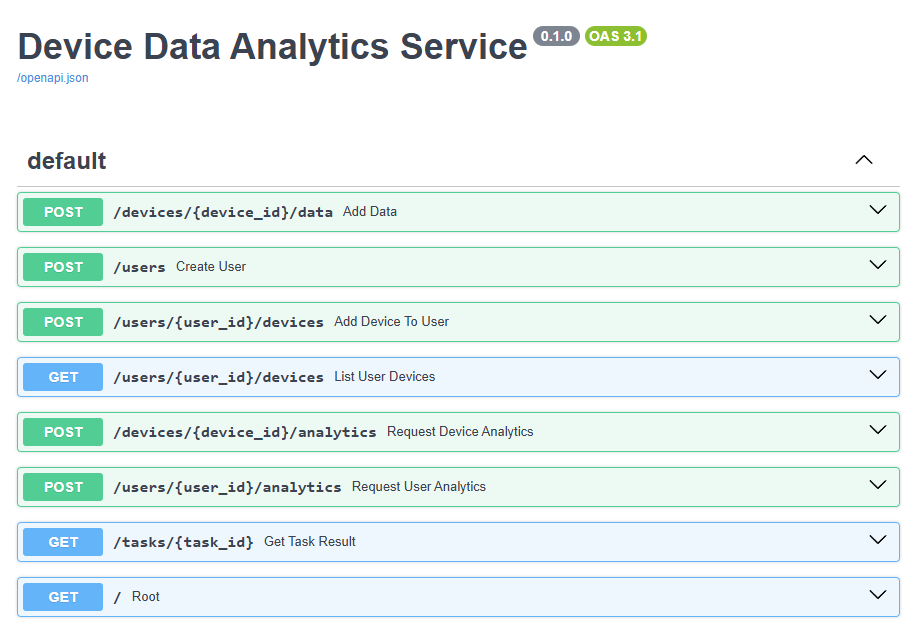

# Сервис сбора и анализа данных с устройств

REST API для учёта, хранения и аналитической обработки телеметрии, поступающей с условных устройств. Сервис принимает показания с координатами `x, y, z`, сохраняет их в PostgreSQL и предоставляет асинхронный расчёт агрегированных статистик (минимум, максимум, сумма, количество, медиана) как по отдельным устройствам, так и по группам, связанным с пользователями.

---

## Основные возможности

- **Приём данных** с устройств по HTTP (JSON).
- **Хранение показаний** с временной меткой и идентификатором устройства.
- **Аналитика за период или за всё время**:
  - по одному устройству;
  - по всем устройствам пользователя (агрегированно и для каждого отдельно).
- **Управление пользователями и привязка устройств** (опционально).
- **Асинхронная обработка** расчётных задач через Celery.
- **Полная контейнеризация** (Docker Compose).
- **Нагрузочное тестирование** с помощью Locust (скрипт прилагается).

---

## Нефункциональные характеристики

| Требование               | Реализация                       |
|--------------------------|----------------------------------|
| Архитектура              | REST (FastAPI)                   |
| База данных              | PostgreSQL 15 (SQLAlchemy)       |
| Асинхронная обработка    | Celery + Redis в качестве брокера |
| Контейнеризация          | Docker, docker-compose           |
| Тестирование нагрузки    | Locust                           |
| Документация API         | Swagger UI (/docs)               |
| Язык                     | Python 3.10+                     |

---

## Структура проекта
project_root/
├── app/
│ ├── main.py # Инициализация FastAPI, эндпоинты
│ ├── models.py # SQLAlchemy-модели User, Device, DataPoint
│ ├── database.py # Настройка подключения к БД
│ ├── schemas.py # Pydantic-схемы запросов/ответов
│ ├── tasks.py # Celery-задачи для аналитики
│ └── celery_app.py # Инициализация Celery
├── Dockerfile # Сборка образа веб-приложения и воркера
├── docker-compose.yml # Запуск всех сервисов
├── locustfile.py # Сценарий нагрузочного тестирования
├── requirements.txt # Зависимости проекта
└── README.md

